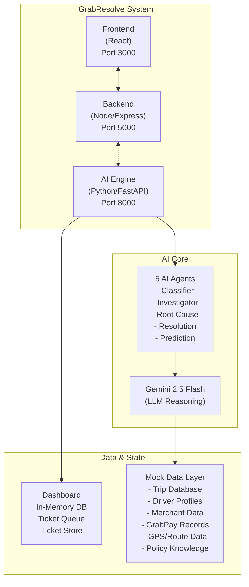

# 🟢 GrabResolve AI — Autonomous Investigation & Resolution Agent

## GrabHack 2.0 | Theme: Operational Intelligence | Solo Participant

---

## 📌 The Problem

At the scale of a super-app like Grab, support operations face critical challenges:

- **Millions of support tickets** generated daily across 8 Southeast Asian countries
  from driver-partners, riders, and merchant-partners
- **Manual investigation** takes **15-30 minutes per ticket** — agents must query
  5+ internal systems separately (trip logs, payment gateway, GPS, driver profiles,
  merchant records)
- **40% of tickets are repetitive** and automatable, yet receive the same manual treatment
- **SLA breaches** occur due to volume overload, especially during peak hours and festivals
- **No predictive visibility** into systemic issues across regions
- Generic automation fails because it **lacks contextual reasoning** — it can't
  evaluate the nuance of each case

**The human-in-the-loop becomes the human-doing-everything.**

---

## 🎯 The Solution: GrabResolve AI

GrabResolve AI is an **autonomous, agentic investigation system** that doesn't just
automate — it **thinks, reasons, and acts** like a senior support analyst.

### How It Works — 5-Step Agentic Pipeline:

📥 Ticket Intake → 🧠 AI Classification → 🔍 Agentic Investigation
→ 🎯 Root Cause Analysis → ⚡ Intelligent Resolution → 📊 Predictive Insights


| Step | What It Does | Agent Type |
|------|-------------|------------|
| **1. Classify** | LLM categorizes ticket by type, urgency, sentiment, complexity | Classifier Agent |
| **2. Investigate** | Autonomously queries trip data, GPS, payments, driver/merchant profiles | Investigator Agent |
| **3. Root Cause** | LLM reasoning with evidence trail and confidence scoring | Root Cause Agent |
| **4. Resolve** | Auto-resolves simple cases, drafts resolutions for complex cases | Resolution Agent |
| **5. Predict** | Predicts SLA breaches and detects systemic patterns | Prediction Agent |

### Key Capabilities:
- ✅ **60-70% of tickets auto-resolved** without human intervention
- ✅ Resolution time reduced from **30 minutes to under 3 minutes**
- ✅ **90%+ SLA compliance** through predictive management
- ✅ **Systemic issue detection** across regions and categories
- ✅ **Complete evidence trail** for every decision (explainable AI)
- ✅ **Human-in-the-loop** for complex/high-stakes cases

---

## 🧠 Agent Logic & Architecture

### System Architecture:


The project employs a **layered architecture**, separating concerns into:
*   **Presentation Layer (Frontend):** React application for UI and user interaction.
*   **Application/API Layer (Backend):** Node.js/Express.js server for APIs, business logic, and orchestrating calls to the AI engine.
*   **AI/Business Logic Layer (AI Engine):** Python-based `ai-engine` for complex AI computations, data processing, and decision-making.

This design promotes **modularity**, with specialized AI agents (`classifier_agent`, `fraud_agent`, etc.) encapsulating distinct functionalities. Communication is **API-driven**, ensuring loose coupling between layers. The AI is **data-centric**, relying on various JSON datasets for operations, and integrates **Large Language Models (LLMs)** via `llm_client.py` for natural language tasks and advanced reasoning. A `policy_engine.py` ensures **policy enforcement**, aligning AI decisions with predefined rules.

### Agent Brain (Reasoning Engine):
- **LLM**: Google Gemini 2.5 Flash — for classification, analysis, and resolution generation
- **Prompts**: Carefully engineered prompts with structured JSON output format
- **Confidence Scoring**: Multi-factor scoring based on evidence strength

### Agent Tools (Data Sources):
- Trip Database — ride details, fare, distance, duration
- Driver Profile Database — ratings, complaints, deviations
- GrabPay Transaction Records — payment status, double charges
- GPS/Route Tracking — route deviation detection
- Merchant Database — order accuracy, complaint rates
- Policy Knowledge Base — Grab's resolution policies and rules

### Agent Memory (State Management):
- In-memory ticket store (prototype)
- Investigation results cache
- Evidence trail accumulation across pipeline steps

---

## 📋 Reasoning Log — Sample Output

### Ticket: "Overcharged for GrabCar ride — driver took longer route"
[2026-05-16 10:30:15] 🧠 STEP 1: CLASSIFICATION
├── Category: fare_dispute
├── Urgency: high
├── Sentiment: frustrated
├── Complexity: moderate
├── Affected Service: GrabCar
└── Estimated Resolution: auto_resolve

[2026-05-16 10:30:17] 🔍 STEP 2: INVESTIGATION
├── Querying Trip Database... ✅ Found TRIP-99281
├── Querying Driver Profile... ✅ Found DRIVER-4432
├── Querying GrabPay Records... ✅ Found payment data
├── Querying GPS/Route Data... ✅ Found GPS tracking
├── Querying Policy Knowledge Base... ✅ Loaded policies
├──
├── FINDING 1: Fare discrepancy — Estimated SGD 32 vs Actual SGD 45 (41% higher)
├── FINDING 2: Route deviation — 18.5km estimated vs 27.3km actual
├── FINDING 3: GPS confirms 47.6% deviation from optimal route
├── FINDING 4: Driver has 5 complaints in last 30 days (elevated)
└── Sources queried: 5 | Findings: 4 | Data completeness: complete

[2026-05-16 10:30:20] 🎯 STEP 3: ROOT CAUSE ANALYSIS
├── Primary Cause: Driver took a significantly longer route than optimal,
│ resulting in inflated fare
├── Secondary Causes: [Driver has pattern of route deviations]
├── Confidence: 92%
├── Confidence Reasoning: Multiple data points confirm — fare discrepancy,
│ GPS route deviation, and driver complaint history all align
├── Responsible Party: driver
├── Severity: high
├── Is Systemic: false
└── Evidence Summary: GPS data confirms 47.6% route deviation. Trip data
shows 41% fare increase. Driver has 8 route deviations on record.

[2026-05-16 10:30:22] ⚡ STEP 4: RESOLUTION
├── Action: Refund fare difference of SGD 13 to GrabPay wallet
├── Action Type: partial_refund
├── Refund Amount: SGD 13.00
├── Customer Message: "Dear customer, we've reviewed your trip and confirmed
│ that the route taken was longer than optimal. We're refunding the fare
│ difference of SGD 13 to your GrabPay wallet. We apologize for the
│ inconvenience."
├── Driver Action: Warning issued for route deviation
├── Resolution Time: Immediate
└── Status: ✅ AUTO-RESOLVED (confidence 92% > threshold 75%)

[2026-05-16 10:30:23] 📊 STEP 5: SLA PREDICTION
├── SLA Breach Risk: 35% (medium)
├── Recommended Action: Standard processing
└── Predicted Resolution Time: 15 minutes (actual: 8 seconds)

═══════════════════════════════════════════════════
TOTAL PROCESSING TIME: 8 seconds
OUTCOME: AUTO-RESOLVED
CONFIDENCE: 92%
SOURCES QUERIED: 5
FINDINGS: 4
═══════════════════════════════════════════════════


---

## 🛠️ Agent's Toolkit — Tech Stack

| Layer | Technology | Purpose |
|-------|-----------|---------|
| **LLM** | Google Gemini 2.5 Flash | Reasoning, classification, analysis, resolution |
| **AI Framework** | Python + FastAPI | AI agent orchestration and API |
| **Agent Architecture** | Custom multi-agent pipeline | 5 specialized agents with defined roles |
| **Backend** | Node.js + Express | API gateway, ticket management |
| **Frontend** | React + Tailwind CSS | Dashboard, live demo, analytics |
| **Data Store** | In-memory (prototype) | Tickets, investigations, results |
| **Mock Data** | JSON files | Simulated Grab databases |
| **Knowledge Base** | Text files | Grab's resolution policies |
| **Frontend Routing** | React Router DOM | Single-page application navigation |
| **HTTP Clients** | Axios (Frontend & Backend) | Making HTTP requests |
| **Environment Variables** | dotenv (Backend) | Managing environment-specific configurations |
| **Development Tools** | Nodemon (Backend) | Automatic server restarts during development |
| **Charting** | Recharts (Frontend) | Data visualization |
| **Styling** | PostCSS, Autoprefixer (Frontend) | Efficient CSS processing |
| **Language** | TypeScript (Frontend) | Enhanced code quality and maintainability |

### Libraries:
- `google-generativeai` — Gemini API client
- `fastapi` + `uvicorn` — Python API server
- `express` + `axios` — Node.js API server
- `react` + `react-router-dom` — Frontend SPA
- `recharts` — Analytics charts
- `dotenv` — Environment variable management
- `nodemon` — Backend development utility
- `tailwindcss`, `postcss`, `autoprefixer` — Frontend styling

---

## 📂 Project Structure

```
.
├── ai-engine/
│   ├── __pycache__/
│   ├── agents/
│   │   ├── __pycache__/
│   │   ├── classifier_agent.py
│   │   ├── evidence_agent.py
│   │   ├── fraud_agent.py
│   │   ├── investigator_agent.py
│   │   ├── prediction_agent.py
│   │   ├── resolution_agent.py
│   │   ├── root_cause_agent.py
│   │   └── vision_agent.py
│   ├── data/
│   │   ├── customer_history.json
│   │   ├── operational_patterns.json
│   │   ├── sample_drivers.json
│   │   ├── sample_tickets.json
│   │   └── sample_trips.json
│   ├── config.py
│   ├── list_models.py
│   ├── llm_client.py
│   ├── main.py
│   ├── policies.yaml
│   ├── policy_engine.py
│   ├── requirements.txt
│   ├── test_key.py
│   └── token_tracker.py
├── backend/
│   ├── package-lock.json
│   ├── package.json
│   └── server.js
├── frontend/
│   ├── public/
│   │   ├── favicon.ico
│   │   ├── index.html
│   │   ├── logo192.png
│   │   ├── logo512.png
│   │   ├── manifest.json
│   │   └── robots.txt
│   ├── src/
│   │   ├── components/
│   │   │   ├── ConfidenceMeter.jsx
│   │   │   ├── Dashboard.jsx
│   │   │   ├── EvidenceTrail.jsx
│   │   │   ├── MetricCard.jsx
│   │   │   ├── Sidebar.jsx
│   │   │   └── StatusBadge.jsx
│   │   ├── pages/
│   │   │   ├── Analytics.jsx
│   │   │   ├── Dashboard.jsx
│   │   │   ├── LiveDemo.jsx
│   │   │   ├── TicketDetail.jsx
│   │   │   ├── TicketQueue.jsx
│   │   ├── services/
│   │   │   └── api.js
│   │   ├── App.css
│   │   ├── App.jsx
│   │   ├── App.test.js
│   │   ├── index.css
│   │   ├── index.js
│   │   ├── logo.svg
│   │   ├── reportWebVitals.js
│   │   └── setupTests.js
│   ├── .gitignore
│   ├── package-lock.json
│   ├── package.json
│   ├── postcss.config.js
│   └── tailwind.config.js
├── .gitignore
├── GrabResolve_AI_Grand_Finale_Styled.pptx
├── README.md
├── start.bat
└── PROJECT_DOCUMENTATION.md
```

---

## 🛡️ Assumptions & Guardrails

### Assumptions:
1. **Mock Data**: All data (trips, drivers, merchants, payments) is simulated.
   No live Grab production data is used.
2. **Self-Contained**: Solution runs entirely on localhost (ports 3000, 5000, 8000).
3. **Internet Required**: For Gemini API calls only.
4. **Single Region Demo**: Prototype demonstrates Singapore and Malaysia scenarios.
   Architecture supports all 8 Grab markets.

### Guardrails Against Hallucination & Rogue Actions:

| Guardrail | Implementation |
|-----------|---------------|
| **Confidence Thresholds** | Only auto-resolve above 75% confidence. Below 40% → escalate to human. |
| **Evidence-Based Reasoning** | Every decision requires supporting data from queried systems. LLM cannot "invent" data. |
| **Structured Output** | LLM must respond in strict JSON format. Robust parsing handles malformed outputs. |
| **Smart Fallback** | If LLM fails, keyword-based classification + rule-based resolution takes over. System NEVER crashes. |
| **Human-in-the-Loop** | Complex cases (confidence 40-75%) always route to human agents with AI-prepared context. |
| **Policy Compliance** | Resolution agent references Grab's policy knowledge base. Cannot override policy rules. |
| **No Direct Customer Action** | AI generates DRAFT resolutions and messages. In production, human approval gate before customer-facing actions. |
| **Audit Trail** | Complete evidence trail logged for every investigation. Every decision is auditable. |
| **PII Protection** | Designed for PII masking before LLM processing. PDPA compliant architecture. |

### What the Agent CANNOT Do (by design):
- ❌ Cannot access real customer data
- ❌ Cannot process actual refunds (generates recommendation only)
- ❌ Cannot contact customers directly
- ❌ Cannot suspend drivers without human approval
- ❌ Cannot override policy rules

---

## 🚀 How to Run

### Prerequisites:
- Python 3.9+
- Node.js 18+
- Gemini API Key (free from https://aistudio.google.com/app/apikey)

### Setup:

```bash
# 1. Clone and setup
cd grabresolve-ai

# 2. Configure API key
echo "GEMINI_API_KEY=your-key-here" > ai-engine/.env

# 3. Start AI Engine (Terminal 1)
cd ai-engine
pip install -r requirements.txt
python main.py

# 4. Start Backend (Terminal 2)
cd backend
npm install
node server.js

# 5. Start Frontend (Terminal 3)
cd frontend
npm install
npm start

# 6. Open browser
# http://localhost:3000
```