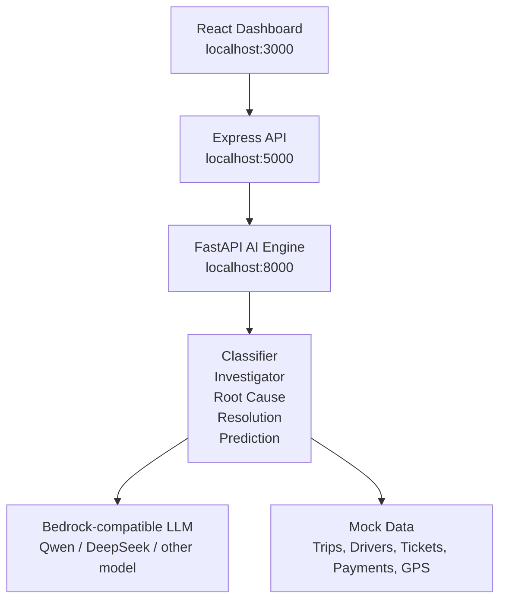

# GrabResolve AI

Autonomous investigation and resolution agent for support operations. The demo runs as three local services:

- React frontend on port `3000`
- Node/Express backend on port `5000`
- Python/FastAPI AI engine on port `8000`

## What It Does

GrabResolve AI takes a support ticket through a five-step pipeline:

1. Classify the ticket by category, urgency, sentiment, and affected service.
2. Query mock operational data such as trips, GPS, payments, drivers, and tickets.
3. Determine root cause with confidence scoring.
4. Generate a fair resolution recommendation and customer message.
5. Predict SLA breach risk and recommended handling.

The system keeps an evidence trail for every automated decision and routes low-confidence cases to human review or escalation.

## Architecture



## Recommended Model

For the main reasoning pipeline, use:

```env
NOVA_MODEL=qwen.qwen3-235b-a22b-2507
```

This project can call Bedrock in two ways:

- `LLM_PROVIDER=bedrock` uses AWS credentials with `boto3`. This is best for the temporary AWS credentials you have.
- `LLM_PROVIDER=openai_compatible` uses a Bedrock/Mantle bearer API key through `NOVA_BASE_URL` and `NOVA_API_KEY`.

### Using AWS Temporary Credentials

In Windows Command Prompt:

```bat
set AWS_DEFAULT_REGION=us-west-2
set AWS_ACCESS_KEY_ID=your_access_key_id
set AWS_SECRET_ACCESS_KEY=your_secret_access_key
set AWS_SESSION_TOKEN=your_session_token
set LLM_PROVIDER=bedrock
set NOVA_MODEL=qwen.qwen3-235b-a22b-2507-v1:0
```

In PowerShell:

```powershell
$env:AWS_DEFAULT_REGION="us-west-2"
$env:AWS_ACCESS_KEY_ID="your_access_key_id"
$env:AWS_SECRET_ACCESS_KEY="your_secret_access_key"
$env:AWS_SESSION_TOKEN="your_session_token"
$env:LLM_PROVIDER="bedrock"
$env:NOVA_MODEL="qwen.qwen3-235b-a22b-2507-v1:0"
```

Good model IDs from your available list:

```text
qwen.qwen3-235b-a22b-2507-v1:0     # best default for this project
deepseek.v3.2                      # strong reasoning alternative
qwen.qwen3-32b-v1:0                # faster/cheaper general model
zai.glm-4.7-flash                  # fast lightweight option
zai.glm-5                          # strong general model
```

Embedding models such as `amazon.titan-embed-text-v2:0` are only for search/RAG, not the chat pipeline.

### Using Bedrock API Key

Example AI engine config:

```env
LLM_PROVIDER=openai_compatible
NOVA_BASE_URL=https://bedrock-mantle.us-west-2.api.aws/v1
NOVA_MODEL=qwen.qwen3-235b-a22b-2507
NOVA_API_KEY=your_bedrock_api_key
NOVA_TIMEOUT_SECONDS=60
```

Do not commit `.env` files or AWS credentials.

## Setup

### 1. AI Engine

```powershell
cd C:\Users\firewolf\Desktop\grabresolve-ai\ai-engine
.\.venv\Scripts\python.exe -m pip install -r requirements.txt
.\.venv\Scripts\python.exe main.py
```

If your environment uses `venv` instead of `.venv`, replace `.\.venv\Scripts\python.exe` with `.\venv\Scripts\python.exe`.

### 2. Backend

Optional backend environment:

```env
PORT=5000
AI_ENGINE_URL=http://localhost:8000
```

Run:

```powershell
cd C:\Users\firewolf\Desktop\grabresolve-ai\backend
npm install
npm start
```

### 3. Frontend

Optional frontend environment:

```env
REACT_APP_API_URL=http://localhost:5000/api
```

Run:

```powershell
cd C:\Users\firewolf\Desktop\grabresolve-ai\frontend
npm install
npm start
```

Open `http://localhost:3000`.

## Useful Checks

```powershell
cd C:\Users\firewolf\Desktop\grabresolve-ai\ai-engine
.\.venv\Scripts\python.exe -m compileall agents main.py config.py llm_client.py
.\.venv\Scripts\python.exe test_key.py

cd C:\Users\firewolf\Desktop\grabresolve-ai\backend
node --check server.js

cd C:\Users\firewolf\Desktop\grabresolve-ai\frontend
npm run build
```

## Demo Flow

1. Start all three services.
2. Open the dashboard.
3. Click **Load Sample Tickets**.
4. Run **Investigate All** or open a single ticket.
5. Review classification, findings, root cause, resolution, SLA prediction, and evidence trail.

## Guardrails

- Auto-resolution only happens above the configured confidence threshold.
- Medium-confidence cases go to human review.
- Low-confidence cases are escalated.
- Every decision includes an evidence trail.
- The demo uses mock data only.
- The AI engine produces recommendations; it does not perform real refunds, contact customers, or suspend drivers.
